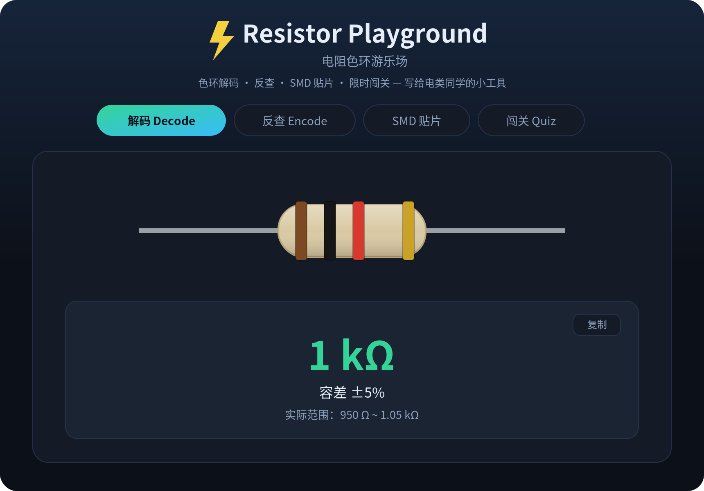

# ⚡ Resistor Playground · 电阻色环游乐场

> 读色环、反查色环、限时闯关——一个写给电类同学的零依赖网页小工具。
> Decode, encode and gamify resistor color bands — a zero-dependency web toy for EE students.

[](https://kkkakania.github.io/resistor-playground/)
[](LICENSE)


单个 `index.html`，没有任何依赖，双击即可打开，也可一键挂到 GitHub Pages。
A single `index.html` with no build step and no dependencies — open it directly or host it on GitHub Pages.

## 📸 预览 Preview



> 想要实时交互？打开 **[在线演示 Live Demo](https://kkkakania.github.io/resistor-playground/)**。

## ✨ 功能 Features

- **🎨 解码 Decode** — 选择每一环颜色，电阻图实时更新，算出阻值、容差和实际范围。支持 **4 / 5 / 6 环**（6 环含温度系数 ppm/°C）。
- **🔢 反查 Encode** — 输入目标阻值（Ω / kΩ / MΩ）和容差，自动给出对应色环，并提示**最接近的 E24 标准值**。
- **🔲 SMD 贴片** — 识别贴片电阻代码：**3 位 / 4 位 / 含 R 小数 / EIA-96 (1%)**，带小芯片示意图。
- **🎮 闯关 Quiz** — 随机出题、四选一、10 秒倒计时；支持**键盘 1–4 作答**，最高连击用 `localStorage` **本地保存**。
- **🌗 实验室深色主题**，响应式、移动端适配，结果可一键复制；颜色对照表常驻底部。

## 🚀 在线体验 Live Demo

部署后访问：**https://kkkakania.github.io/resistor-playground/**

## 🖥️ 本地运行 Run Locally

```bash
git clone https://github.com/Kkkakania/resistor-playground.git
cd resistor-playground
# 直接用浏览器打开 index.html 即可；或起一个本地服务：
python3 -m http.server 8000   # 然后访问 http://localhost:8000
```

## 🎨 色环对照表 Color Code Reference

| 颜色 Color | 数字 Digit | 倍率 Multiplier | 容差 Tolerance |
|---|---|---|---|
| 黑 Black | 0 | ×1 | — |
| 棕 Brown | 1 | ×10 | ±1% |
| 红 Red | 2 | ×100 | ±2% |
| 橙 Orange | 3 | ×1k | — |
| 黄 Yellow | 4 | ×10k | — |
| 绿 Green | 5 | ×100k | ±0.5% |
| 蓝 Blue | 6 | ×1M | ±0.25% |
| 紫 Violet | 7 | ×10M | ±0.1% |
| 灰 Grey | 8 | ×100M | ±0.05% |
| 白 White | 9 | ×1G | — |
| 金 Gold | — | ×0.1 | ±5% |
| 银 Silver | — | ×0.01 | ±10% |

> 数据依据 IEC 60062 电阻色环标准。Data based on the IEC 60062 standard.

**口诀小抄**：棕红橙黄绿，蓝紫灰白黑——对应 1 2 3 4 5、6 7 8 9 0。

第 6 环**温度系数 (ppm/°C)**：棕 100、红 50、橙 15、黄 25、蓝 10、紫 5。

## 🔲 SMD 贴片代码 SMD Codes

| 类型 | 规则 | 示例 |
|---|---|---|
| 3 位 | 前两位有效 + 第三位补零 | `473` = 47×10³ = 47kΩ |
| 4 位 (1%) | 前三位有效 + 末位补零 | `1002` = 100×10² = 10kΩ |
| 含 R | R 代表小数点 | `4R7` = 4.7Ω，`R47` = 0.47Ω |
| EIA-96 (1%) | 两位代码查表 + 字母乘数 | `01C` = 100×100 = 10kΩ |

> EIA-96 乘数字母：Z=×0.001，Y=×0.01，X=×0.1，A=×1，B/H=×10，C=×100，D=×1k，E=×10k，F=×100k。

## 🗓️ 更新日志 Changelog

- **v2** — 新增 SMD 贴片解码、6 环温度系数、E24 标准值提示；闯关支持键盘作答与最高分本地保存；移动端与复制等体验优化。
- **v1** — 色环解码 / 反查 / 闯关三合一。

## 🛠️ 技术 Tech

纯 HTML + CSS + 原生 JavaScript，电阻用内联 SVG 绘制，无外部库、无网络请求。
Plain HTML + CSS + vanilla JS; the resistor is drawn with inline SVG. No libraries, no network calls.

## 📄 License

[MIT](LICENSE) © 2026
